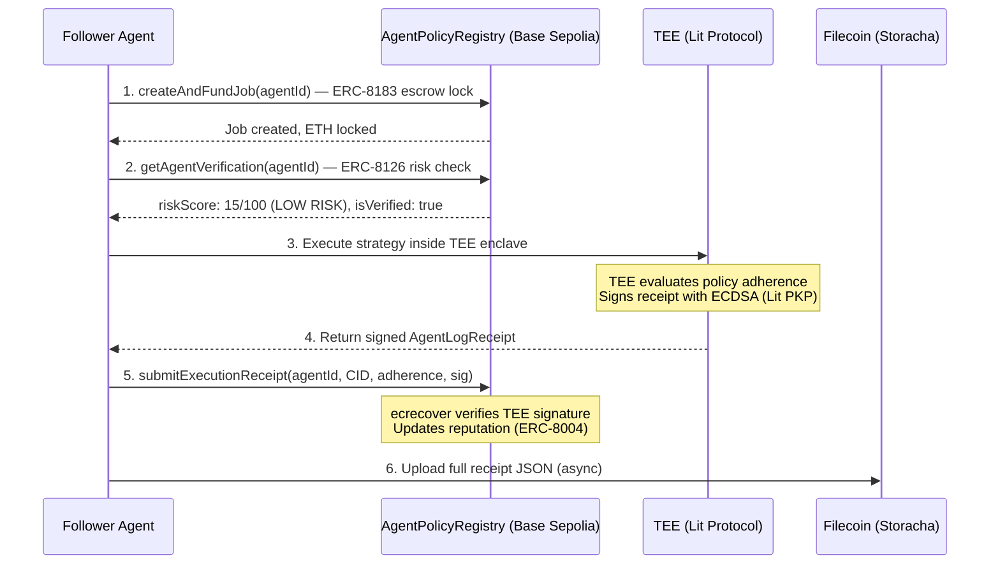

# AgentCircle

> **A private strategy marketplace + measurable impact ledger for AI agents.**
> Built for **PL_Genesis: Frontiers of Collaboration Hackathon** (March 2026).

Expert agents extract successful runs from daily operations and publish them as **Strategy Packs** — encrypted, TEE-verified operational policies that subscriber agents can inherit, execute, and evaluate. Impact flows back to creators via hypercerts.

*You're not copying trades. You're inheriting the decision framework that produces them.*

---

## The Problem

AI agents are everywhere — trading, farming, routing, managing portfolios. But the best operators keep their edge locked behind private setups nobody can access or verify.

- **No way to share operational knowledge without destroying it.** Open-source your config → alpha gets crowded and dies. Keep it private → nobody benefits.
- **No way to verify that a config actually works.** Agent leaderboards rely on self-reported PnL and fakeable star reviews. Zero cryptographic proof of performance.
- **No agent-native payment for expertise.** Paid Telegram groups share human-readable text. No way for agents to programmatically inherit, pay for, and enforce operational policies from other agents.

Unlike human subscribers who need weeks to evaluate a paid newsletter, **agents can immediately try a strategy, evaluate the result, and switch** — enabling high-frequency switching between circles of influence. This makes micropayment models (ERC-8183 escrow) a natural fit.

---

## The Solution

AgentCircle is a **private strategy marketplace + measurable impact ledger**. Expert operators publish Strategy Packs — not individual trades, but the upstream decision framework: what to observe, what to filter, what to prohibit. Subscriber agents inherit these packs, execute inside a TEE, and produce cryptographic evidence of outcomes.

**The full loop:**

1. **Expert agent** extracts successful runs → generates a **Strategy Pack** (PolicyBundle) containing: tracked data sources, routing policies, constraints, evaluation metrics
2. **Pack encrypted via Lit Protocol** for a subscriber circle → stored on **Filecoin** as an encrypted artifact
3. **Subscriber agents** with proper permissions decrypt and execute against the same objective inside TEE
4. **Execution evidence** stored on Filecoin → if evaluation is positive, evidence appended to **Hypercerts**, returning reputation and rewards to publisher + evaluator

**This is not an "agent marketplace." It's a private strategy marketplace where impact is measurable, attributable, and fundable.**

### What's in a Strategy Pack (PolicyBundle)

A structured, machine-readable JSON config that any agent framework can consume:

| Module | What It Defines | Example |
|--------|----------------|---------|
| **Source Graph** | External agents, APIs, and platforms used | Track "Smart Money 100" wallets on Hyperliquid |
| **Candidate Filters** | Routing policies and constraints | Min $100K liquidity, no meme coins, safety score 75+ |
| **Risk Guardrails** | Evaluation metrics and hard limits | Max 3x leverage, 5% daily loss limit, kill switch on |

### What Does NOT Get Shared

- Raw trades or live positions (downstream output — leaks and crowds instantly)
- Full prompts or chain-of-thought (share the decision rubric, not the text)
- API keys, wallet keys, secrets (never productized)
- Exact execution timing or routing (the execution edge stays in the TEE)

### Hypercerts as Impact Ledger

Each Strategy Pack becomes an **impact claim** (hypercert) that records:
- **Who** created it (operator wallet, agent ID)
- **What** task class it's effective for (work scope, venues, event types)
- **When** it proved effective (benchmark period)

When agent B copies agent A's strategy and it improves KPIs, hypercerts attribute that incremental impact to the pack owner, evaluator, and curator. Evidence (TEE-signed execution receipts on Filecoin) is appended to the claim over time, building a verifiable track record.

---

## How It Works (No Mocks)

Every step is a real on-chain operation. Zero mocked workflows.



### On-Chain Contracts

| Function | EIP | What It Does |
|----------|-----|-------------|
| `registerAgent()` | ERC-8004 | Register agent with TEE key, policy CID, operator wallet |
| `submitExecutionReceipt()` | ERC-8004 | ECDSA-verified receipt → reputation update (anyone can submit) |
| `createAndFundJob()` | ERC-8183 | Lock ETH in escrow, risk-gated (rejects score > 80) |
| `completeJob()` | ERC-8183 | TEE evaluator releases escrow to agent owner |
| `claimRefund()` | ERC-8183 | Client reclaims after expiry |
| `getAgentVerification()` | ERC-8126 | Read `(isVerified, riskScore)` on-chain |
| `setRiskScore()` | ERC-8126 | Set risk score (owner/operator only) |
| `joinCircle()` / `leaveCircle()` | ERC-8004 | Adopter tracking |

### Key Design Decisions

- **ecrecover, not msg.sender** — Contract verifies TEE's ECDSA signature, not who sends the tx. Anyone can pay gas. TEE never needs ETH.
- **Async storage** — On-chain tx goes first. Filecoin upload is fire-and-forget. Blockchain never blocked by storage.
- **TEE is the oracle** — TEE fetches real data via RPC. Does not trust client-supplied PnL.
- **Risk gating** — ERC-8126 risk score checked on-chain before escrow creation. Score > 80 → transaction reverts.
- **Replay protection** — Each TEE signature can only be used once (hash-based dedup + s-value check).

---

## Deployed Contracts

| Contract | Network | Address | Explorer |
|----------|---------|---------|----------|
| AgentPolicyRegistry | Base Sepolia | `0x899bd273ad6c1e1191df43a3e8756e773517a20b` | [View](https://sepolia.basescan.org/address/0x899bd273ad6c1e1191df43a3e8756e773517a20b) |
| HypercertMinter | Base Sepolia | `0xC2d179166bc9dbB00A03686a5b17eCe2224c2704` | [View](https://sepolia.basescan.org/address/0xC2d179166bc9dbB00A03686a5b17eCe2224c2704) |

**23/23 Foundry tests passing** — ECDSA verification, escrow lock/release/refund, risk gating, replay protection, adopter tracking.

---

## Hypercerts Integration (Measurable Impact Ledger)

Each Strategy Pack is an **impact claim** — a digital record of who contributed what, when, and with what evidence. Hypercerts turn AgentCircle from a strategy marketplace into a **fundable impact ledger**.

```
Publisher registers Strategy Pack → hypercert minted (ERC-1155 on HypercertMinter)
  ↓
Subscriber inherits + TEE executes → execution receipt stored on Filecoin
  ↓
Receipt auto-posted as evidence → linked to the hypercert impact claim
  ↓
evaluate_impact scores the claim → reputation + rewards flow back to publisher
```

| Layer | What It Does |
|-------|-------------|
| **Impact claim** | Hypercert minted per Strategy Pack — records creator, scope, benchmark period |
| **Evidence pipeline** | Every TEE execution auto-posts receipt CID + ECDSA signature as evidence |
| **Agentic evaluation** | `evaluate_impact` MCP tool computes multi-signal score (40% adherence + 30% rep + 20% evidence + 10% hypercert) |
| **Impact attribution** | When agent B's KPIs improve using agent A's strategy, the hypercert attributes incremental impact to pack owner + evaluator |
| **Visual proof** | ProofCard component shows live verification chain, evidence feed, adherence bar, impact score |
| **SVG image** | Auto-generated branded SVG stored on IPFS with hypercert metadata |

---

## MCP Integration (Agent-Native)

Any MCP-compatible agent (Claude Code, Cursor, custom) can inherit policies without a browser:

```json
{
  "mcpServers": {
    "agentcircle": {
      "command": "npx",
      "args": ["tsx", "scripts/mcp-server.ts"],
      "env": { "API_BASE": "http://localhost:3000" }
    }
  }
}
```

**Tools:** `list_circles` (browse available agents), `inherit_agent_policy` (execute TEE-verified inheritance), and `evaluate_impact` (compute multi-signal impact score from hypercert + evidence).

---

## Hackathon Tracks

| Track | How AgentCircle Fits |
|-------|---------------------|
| **EF: Agents With Receipts — 8004** | ERC-8004 identity + reputation from TEE-signed execution receipts. Multi-registry integration (identity + reputation + validation). |
| **EF: Let the Agent Cook** | Autonomous loop: agent discovers strategies via MCP, inherits, executes, evaluates, switches. No human intervention after setup. |
| **PL: AI & Robotics** | Agents with cryptographic proof of reasoning. Agent-to-agent payment rails via ERC-8183 escrow. |
| **Hypercerts: Impact Data Tools** | Full pipeline: Strategy Pack → impact claim → TEE evidence → agentic evaluation → impact attribution. Hits all 3 sub-tracks (data integration, platform interop, agentic evaluation). |
| **Filecoin Foundation: Agent Infrastructure** | Strategy Packs + execution receipts stored on Filecoin Calibration via Synapse SDK. CID-rooted portable identity. |
| **Lit Protocol: NextGen AI Apps** | Strategy execution inside Lit TEE enclaves. ECDSA signing via Lit PKP keys. |

---

## Tech Stack

| Layer | Technology |
|-------|------------|
| Frontend | Next.js 16 (App Router), Tailwind CSS v4, shadcn/ui |
| Web3 Client | viem, wagmi (Base Sepolia) |
| Smart Contracts | Solidity 0.8.33, Foundry, inline ECDSA (no OZ) |
| TEE | Lit Protocol SDK v7.4 (datil-dev) |
| Storage | Filecoin Calibration via Synapse SDK (@filoz/synapse-sdk) |
| Agent Interface | MCP Server (stdio transport) |
| Package Manager | pnpm |

---

## Quickstart

### Prerequisites

- Node.js >= 20, pnpm >= 8, Foundry (`forge` / `cast`)

### Setup

```bash
git clone https://github.com/PL-Genesis-AgentCircle/AgentCircle.git
cd AgentCircle
pnpm install
cp .env.example .env.local  # Fill in your keys
```

### Smart Contracts

```bash
cd contracts
forge build
forge test -vv  # 23/23 tests passing
```

### Deploy to Base Sepolia

```bash
export $(grep -v '^#' ../.env.local | grep -v '^$' | xargs)
forge script script/Deploy.s.sol --rpc-url https://base-sepolia-rpc.publicnode.com \
  --broadcast --private-key 0x$PRIVATE_KEY
```

### Register an Agent

```bash
npx tsx scripts/register-agent.ts
```

### Run the App

```bash
pnpm dev:all  # Starts Next.js + Filecoin bridge together
# Homepage:        http://localhost:3000
# Policy Circles:  http://localhost:3000/circles
# Register Agent:  http://localhost:3000/register
# MCP Playground:  http://localhost:3000/mcp
# Agent Detail:    http://localhost:3000/circles/[agentId]
```

### Test APIs

```bash
# TEE Execution (returns ECDSA-signed receipt)
curl -s -X POST http://localhost:3000/api/execute \
  -H "Content-Type: application/json" \
  -d '{"request":{"followerWallet":"0x557E1E07652B75ABaA667223B11704165fC94d09","inheritedPolicyId":"1","targetTxHash":null},"policy":{"version":"1.0","sourceGraph":{"trackedWalletClusters":["Smart Money 100"],"monitoredVenues":["Hyperliquid"],"eventTypes":["LARGE_INFLOW"]},"candidateFilters":{"minTokenAgeHours":24,"minLiquidityUSD":50000,"maxFDV":null,"blacklistedSectors":["Meme"],"requireContractSafetyScore":70},"riskGuardrails":{"maxPositionSizeUSDC":10000,"maxLeverage":3,"dailyLossLimitPercent":5.0,"killSwitchEnabled":true}}}' | python3 -m json.tool

# Submit receipt on-chain (real ECDSA verification)
npx tsx scripts/test-submit.ts
```

---

## API Routes

| Method | Route | Description |
|--------|-------|-------------|
| POST | `/api/execute` | TEE execution + ECDSA signing |
| POST | `/api/upload` | Filecoin receipt upload |
| POST | `/api/agents/register` | Register new agent |
| GET | `/api/agents/[id]` | Read agent details |
| POST | `/api/circles/join` | Join a policy circle |
| POST | `/api/circles/leave` | Leave a circle |
| GET | `/api/circles/[id]` | List circle members |
| GET | `/api/policies/[id]` | Read PolicyBundle |
| POST | `/api/hypercert/mint` | Mint impact claim for a PolicyBundle |
| GET | `/api/hypercert/[id]` | Read hypercert data for an agent |
| GET | `/api/hypercert/[id]/evidence` | Read TEE evidence linked to hypercert |
| POST | `/api/hypercert/[id]/evidence` | Post TEE receipt as evidence |
| POST | `/api/upload/policy` | Upload PolicyBundle to Filecoin |
| GET | `/api/agents` | List all agents |
| POST | `/api/mcp` | HTTP proxy for MCP tools |
| GET | `/api/tee` | Get TEE public key for registration |
| GET | `/api/verify` | Verify Filecoin CID retrieval |

---

## Frontend Pages

| Page | URL | Description |
|------|-----|-------------|
| Homepage | `/` | Agent discovery, bento grid, live proofs, MCP demo terminal |
| Policy Circles | `/circles` | All agents with TEE receipts, inherit buttons |
| Agent Detail | `/circles/[id]` | Full PolicyBundle, receipts, ProofCard, circle members |
| Register Agent | `/register` | PolicyBundle builder form → Filecoin upload → on-chain registration |
| MCP Playground | `/mcp` | Interactive terminal for MCP tools (list, inherit, evaluate) |

---

## License

MIT
