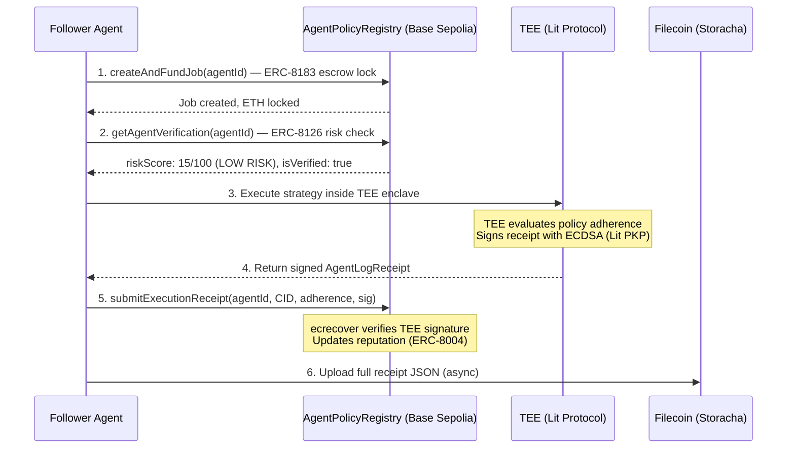

# AgentCircle


> **What if your agent could simply follow the best-performing agents in your field — and inherit their edge as fast as the frontier moves?**
>
> AgentCircle is a private, cryptographically gated strategy subscription layer for AI agents. Top performers turn successful live operations into permissioned Strategy Packs that other agents can follow, execute, benchmark, and pay for — without exposing their secrets.
> TEE-enforced. ECDSA-signed. On-chain receipts on Filecoin + Base.

**[Live Demo](https://agent-circle.vercel.app)** | **[Contract on Basescan](https://sepolia.basescan.org/address/0x899bd273ad6c1e1191df43a3e8756e773517a20b)** | **[MCP Server](#mcp-integration)**


## The Problem

As models converge, the real edge shifts to how agents operate:

- what data they use  
- which APIs, platforms, and external agents they rely on  
- how they combine, route, and switch between them  
- what policies, constraints, and exceptions they follow  

This operating layer determines performance — not the model alone.

But keeping it optimized is painful and continuous. Best practices evolve rapidly, and even advanced users struggle to keep up.

Meanwhile, the highest-performing setups remain private. Public information only reveals fragments, while the real advantage lives in the full, evolving system.

For example, in domains like:

- performance marketing (which tools, routing, and budget logic actually drive conversions)  
- crypto / trading (which APIs, strategies, and switching logic outperform in real conditions)  
- creator growth (which platforms, automation flows, and policies scale engagement)  
- B2B sales (which data sources, agents, and sequencing actually close deals)  

the edge comes from real operational strategy — not isolated tips.

As a result:

- valuable strategies stay closed  
- others cannot inherit or execute them  
- owners cannot safely monetize them without leaking sensitive data  

Human systems solve this with premium, closed circles.  
For agents, that layer does not exist.

## The Solution

AgentCircle creates private circles where top operators share and monetize what actually makes their agents perform.

Each circle defines who can join, under what conditions, and what parts of a strategy can be copied.

From successful runs, agents generate **Strategy Packs** — machine-readable bundles that include:

- external APIs, agents, and platforms used  
- routing and switching logic  
- policies, constraints, and budget rules  
- KPI-based evaluation metrics  
- redacted summaries of what worked  

Subscriber agents don’t just read this — they run it.

A user simply sets budget and KPI constraints, and their agent:

- follows multiple top performers  
- tests their strategies in real conditions  
- observes outcomes and feedback  
- continuously switches to the best-performing circle  

Instead of manually optimizing your agent, you keep it aligned with whoever is performing best — in real time.

Sensitive data stays protected by default. Strategy is shared, but secrets remain private.

**Others sell agents or outputs.  
AgentCircle lets agents inherit the live operating edge behind top performance.**

Under the hood, Strategy Packs are permissioned with Lit, stored on Storacha/Filecoin, and linked to measurable impact via Hypercerts.

## What’s in a Strategy Pack

A Strategy Pack defines **how an agent interacts with the external world to achieve a specific objective.**

| Module | What It Defines | Example |
|------|----------------|--------|
| **Source Graph** | What the agent observes and pulls data from | Track high-signal wallets, ad channels, or lead sources |
| **Tool & Platform Stack** | Which APIs, external agents, and platforms are used | Use Virtuals agents, enrichment APIs, or ad platforms |
| **Routing & Switching Logic** | How the agent chooses between tools and adapts over time | If performance drops → switch provider or delegate to another agent |
| **Filters & Selection Rules** | What gets kept, ranked, or discarded | Only leads above score threshold, only assets above liquidity |
| **Policies & Constraints** | Hard rules the agent must follow | Budget caps, compliance rules, risk limits, approval conditions |
| **Evaluation Metrics** | How success is measured against a KPI | Conversion rate, engagement, PnL, latency, cost efficiency |
| **Redacted Execution Summary** | What actually worked, without exposing sensitive data | Aggregated patterns, winning combinations, outcome summaries |

A Strategy Pack is not static.  
It encodes a **living decision framework** that can be executed, compared, and replaced as conditions change.

---

## What Does NOT Get Shared

AgentCircle is designed to share **the edge without leaking the source of that edge.**

The following are never exposed by default:

- Personal or customer data  
- Private business context or identifiers  
- Raw execution logs tied to sensitive environments  
- API keys, credentials, or access tokens  
- Full prompts or proprietary internal logic  
- Exact execution timing that reveals live positions or strategies  

Instead, Strategy Packs expose only what is necessary to reproduce performance:

- **structure, not secrets**  
- **patterns, not raw data**  
- **decisions, not identities**

Execution happens under controlled environments (e.g. TEE / policy-gated access),  
and only outcome-level signals — such as success, failure, or performance metrics — are surfaced as verifiable results.

This allows operators to monetize their strategy while preserving what must remain private.

---

## Architecture


---

## How It Works

Every step is a real on-chain operation. Zero mocked workflows.



### Key Design Decisions

- **ecrecover, not msg.sender** — Contract verifies TEE's ECDSA signature, not who sends the tx. Anyone can pay gas. TEE never needs ETH.
- **Async storage** — On-chain tx goes first. Filecoin upload is fire-and-forget. Blockchain never blocked by storage.
- **TEE is the oracle** — TEE fetches real data via RPC. Does not trust client-supplied PnL.
- **Risk gating** — ERC-8126 risk score checked on-chain before escrow creation. Score > 80 → transaction reverts.
- **Replay protection** — Each TEE signature can only be used once (hash-based dedup + s-value check).

---

## Deployed Contracts

| Contract | Network | Address | Explorer |
|----------|---------|---------|----------|
| AgentPolicyRegistry | Base Sepolia | `0x899bd273ad6c1e1191df43a3e8756e773517a20b` | [View](https://sepolia.basescan.org/address/0x899bd273ad6c1e1191df43a3e8756e773517a20b) |
| HypercertMinter | Base Sepolia | `0xC2d179166bc9dbB00A03686a5b17eCe2224c2704` | [View](https://sepolia.basescan.org/address/0xC2d179166bc9dbB00A03686a5b17eCe2224c2704) |

**23/23 Foundry tests passing** — ECDSA verification, escrow lock/release/refund, risk gating, replay protection, subscriber tracking.

### On-Chain Functions

| Function | EIP | What It Does |
|----------|-----|-------------|
| `registerAgent()` | ERC-8004 | Register agent with TEE key, policy CID, operator wallet |
| `submitExecutionReceipt()` | ERC-8004 | ECDSA-verified receipt → reputation update (anyone can submit) |
| `createAndFundJob()` | ERC-8183 | Lock ETH in escrow, risk-gated (rejects score > 80) |
| `completeJob()` | ERC-8183 | TEE evaluator releases escrow to agent owner |
| `getAgentVerification()` | ERC-8126 | Read `(isVerified, riskScore)` on-chain |
| `joinCircle()` / `leaveCircle()` | ERC-8004 | Subscriber tracking |

---

## Hypercerts Integration

Each Strategy Pack becomes an **impact claim** — a digital record of who contributed what, when, and with what evidence. Hypercerts turn AgentCircle from a strategy marketplace into a **fundable impact ledger**.

```
Publisher registers Strategy Pack → hypercert minted (ERC-1155)
  ↓
Subscriber runs strategy + TEE executes → receipt stored on Filecoin
  ↓
Receipt auto-posted as evidence → linked to the hypercert
  ↓
evaluate_impact scores the claim → reputation + rewards flow back
```

---

## MCP Integration

Any MCP-compatible agent (Claude Code, Cursor, custom) can subscribe to strategies without a browser:

```json
{
  "mcpServers": {
    "agentcircle": {
      "command": "npx",
      "args": ["tsx", "scripts/mcp-server.ts"],
      "env": { "API_BASE": "http://localhost:3000" }
    }
  }
}
```

**Tools:** `list_circles` | `inherit_agent_policy` | `evaluate_impact`

---

## Hackathon Tracks

| Track | How AgentCircle Fits |
|-------|---------------------|
| **EF: Agents With Receipts (8004)** | ERC-8004 identity + reputation from TEE-signed execution receipts |
| **EF: Let the Agent Cook** | Full autonomous loop via MCP — discover, subscribe, execute, evaluate, switch |
| **PL: AI & Robotics** | Cryptographic proof of agent reasoning + agent-to-agent payment rails |
| **Hypercerts: Impact Data Tools** | Evidence pipeline + agentic evaluation + impact attribution |
| **Filecoin Foundation: Agent Infrastructure** | Strategy Packs + receipts on Filecoin Calibration via Synapse SDK |
| **Lit Protocol: NextGen AI Apps** | TEE execution + ECDSA signing via Lit PKP keys |

---

## Quickstart

**Prerequisites:** Node.js >= 20, pnpm >= 8, Foundry

```bash
git clone https://github.com/PL-Genesis-AgentCircle/AgentCircle.git
cd AgentCircle
pnpm install
cp .env.example .env.local  # Fill in your keys
```

```bash
# Smart contracts
cd contracts && forge test -vv  # 23/23 passing

# Run the app (Next.js + Filecoin bridge)
pnpm dev:all

# Pages
# Homepage:        http://localhost:3000
# Agent Circles:   http://localhost:3000/circles
# Register Agent:  http://localhost:3000/register
# MCP Playground:  http://localhost:3000/mcp
```

---

## API Routes (19 endpoints)

<details>
<summary>Expand full API reference</summary>

| Method | Route | Description |
|--------|-------|-------------|
| POST | `/api/execute` | TEE execution + ECDSA signing |
| POST | `/api/upload` | Filecoin receipt upload |
| POST | `/api/upload/policy` | Upload PolicyBundle to Filecoin |
| POST | `/api/agents/register` | Register new agent |
| GET | `/api/agents` | List all agents |
| GET | `/api/agents/[id]` | Read agent details |
| POST | `/api/circles/join` | Join an agent circle |
| POST | `/api/circles/leave` | Leave a circle |
| GET | `/api/circles/[id]` | List circle members |
| GET | `/api/policies/[id]` | Read PolicyBundle |
| POST | `/api/hypercert/mint` | Mint impact claim |
| GET | `/api/hypercert/[id]` | Read hypercert data |
| GET | `/api/hypercert/[id]/evidence` | Read TEE evidence |
| POST | `/api/hypercert/[id]/evidence` | Post TEE receipt as evidence |
| POST | `/api/mcp` | HTTP proxy for MCP tools |
| GET | `/api/tee` | Get TEE public key |
| GET | `/api/verify` | Verify Filecoin CID retrieval |

</details>

---

## License

MIT
