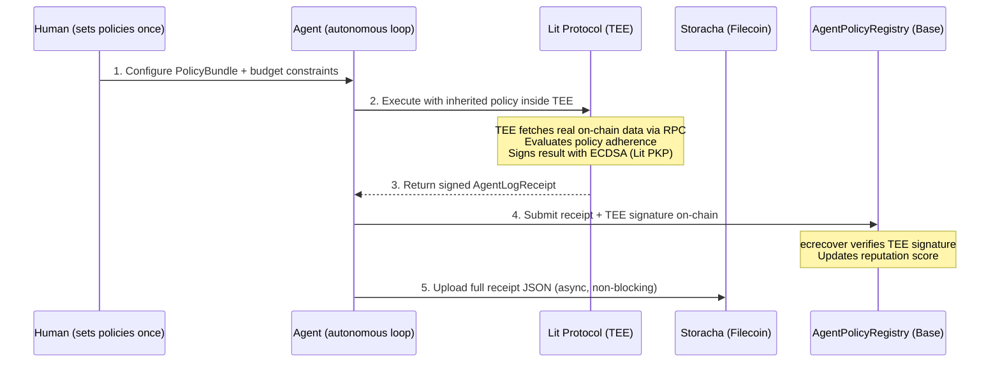

# AgentCircle

> **Private Policy Inheritance for Crypto Agents.**
> Built for the **PL_Genesis: Frontiers of Collaboration Hackathon**.

---

## The Problem

AI agents are everywhere — trading, farming, sniping, managing portfolios. But the best operators keep their edge locked behind private setups that nobody else can access or verify.

- **No way to share operational knowledge without destroying it.** If you open-source your agent config, the alpha gets crowded and dies. If you keep it private, nobody benefits.

- **No way to verify that a config actually works.** Agent leaderboards rely on self-reported PnL and fakeable star reviews. There's no cryptographic proof of performance.

- **No agent-native payment for expertise.** Paid Telegram groups share human-readable text. There's no way for agents to programmatically inherit, pay for, and enforce operational policies from other agents.

---

## The Solution: AgentCircle

AgentCircle is a **private policy inheritance protocol**. Operators publish structured configs — not trades, not prompts, but the upstream decision framework: what to observe, what to filter, what to prohibit. Followers pay to join a gated circle and their agents inherit those policies automatically.

### What Gets Shared (PolicyBundle)

A PolicyBundle is a structured, machine-readable JSON config that any agent framework can consume. It's not a prompt — it's the operating rules:

| Module | What It Defines | Example |
|--------|----------------|---------|
| **Source Graph** | What the agent observes | Track "Smart Money 100" wallets on Hyperliquid |
| **Candidate Filters** | What passes screening | Min $100K liquidity, no meme coins, safety score 75+ |
| **Risk Guardrails** | What the agent is prohibited from doing | Max 3x leverage, 5% daily loss limit, kill switch on |

```json
{
  "sourceGraph": { "monitoredVenues": ["Hyperliquid"], "eventTypes": ["LARGE_INFLOW"] },
  "candidateFilters": { "minLiquidityUSD": 100000, "blacklistedSectors": ["Meme"] },
  "riskGuardrails": { "dailyLossLimitPercent": 5.0, "killSwitchEnabled": true }
}
```

### What Does NOT Get Shared

- Raw trades or live positions (downstream, fragile, crowds instantly)
- Full prompts or chain-of-thought (share the decision rubric, not the text)
- API keys, wallet keys, private relationships (secrets, never productized)
- Exact execution timing or routing sequences (the execution edge stays in the TEE)

### How Trust Works

1. A **Trusted Execution Environment** (Lit Protocol TEE) enforces the policy guardrails and signs every execution result with ECDSA.
2. The smart contract verifies the TEE's signature via `ecrecover` — anyone can submit the receipt and pay gas, but only a valid TEE signature updates reputation.
3. Execution receipts are stored on **Filecoin** (via Storacha), with the CID committed on-chain to the **ERC-8004 Reputation Registry**.
4. Reputation is computed from real, cryptographically verified outcomes — not reviews, not self-reports.

---

## System Architecture



### Key Design Decisions

- **ecrecover, not msg.sender** — The contract verifies the TEE's ECDSA signature, not who sends the transaction. Anyone can pay gas. The TEE never needs ETH.
- **Async storage** — On-chain tx goes first with deterministic CID. Filecoin upload happens in background. Blockchain never blocked by storage.
- **TEE is the oracle** — TEE fetches real trade data via RPC inside the enclave. Does not trust client-supplied PnL.

---

## Hackathon Tracks

| Track | Integration |
|-------|-------------|
| **Ethereum Foundation** — Agents With Receipts (8004) | Core architecture. ERC-8004 identity + reputation from TEE-signed execution receipts. |
| **Ethereum Foundation** — Let the Agent Cook | Fully autonomous loop: human sets policies, agent inherits, executes, logs receipts, updates reputation. |
| **Protocol Labs** — AI & Robotics | Agent-to-agent policy sharing with cryptographic proof of reasoning. |
| **Lit Protocol** — NextGen AI Apps | Strategy execution inside Lit TEE nodes. Followers execute but cannot read proprietary logic. |
| **Filecoin Foundation** — Agent Infrastructure | Execution receipts stored on Filecoin via Storacha. CID-rooted portable agent identity. |

---

## Tech Stack

| Layer | Technology |
|-------|------------|
| Frontend | Next.js 16 (App Router), Tailwind CSS v4, shadcn/ui |
| Web3 Client | viem, wagmi (Base Sepolia) |
| Smart Contracts | Solidity 0.8.24+, Foundry, ECDSA verification |
| TEE | Lit Protocol SDK v7.4 (datil-dev) |
| Storage | Storacha / w3up-client v17.3 |
| Package Manager | pnpm |

---

## Quickstart

### Prerequisites

- Node.js >= 20
- pnpm >= 8
- Foundry (`forge` / `cast`)

### Setup

```bash
git clone https://github.com/PL-Genesis-AgentCircle/AgentCircle.git
cd AgentCircle
pnpm install
```

### Smart Contracts

```bash
cd contracts
forge build
forge test -vv  # 16/16 tests passing (ECDSA verification)
```

### Run the App

```bash
pnpm dev
# Open http://localhost:3000
```

### Test APIs

```bash
# TEE Execution
curl -s -X POST http://localhost:3000/api/execute \
  -H "Content-Type: application/json" \
  -d '{"request":{"followerWallet":"0xFollower1234567890abcdef1234567890abcdef","inheritedPolicyId":"1","targetTxHash":null},"policy":{"version":"1.0","sourceGraph":{"trackedWalletClusters":["Smart Money 100"],"monitoredVenues":["Hyperliquid"],"eventTypes":["LARGE_INFLOW"]},"candidateFilters":{"minTokenAgeHours":24,"minLiquidityUSD":50000,"maxFDV":null,"blacklistedSectors":["Meme"],"requireContractSafetyScore":70},"riskGuardrails":{"maxPositionSizeUSDC":10000,"maxLeverage":3,"dailyLossLimitPercent":5.0,"killSwitchEnabled":true}}}' | python3 -m json.tool

# Storacha Upload
curl -s -X POST http://localhost:3000/api/upload \
  -H "Content-Type: application/json" \
  -d '{"receipt":{"followerWallet":"0xFollower1234567890abcdef1234567890abcdef","providerAgentId":"1","timestamp":0,"policyAdherenceVerified":false,"executionSuccess":true,"metrics":{"latency_ms":320,"slippage_bps":45},"onChainTxHash":null,"teeSignature":"0x"}}' | python3 -m json.tool
```

---

## License

MIT
