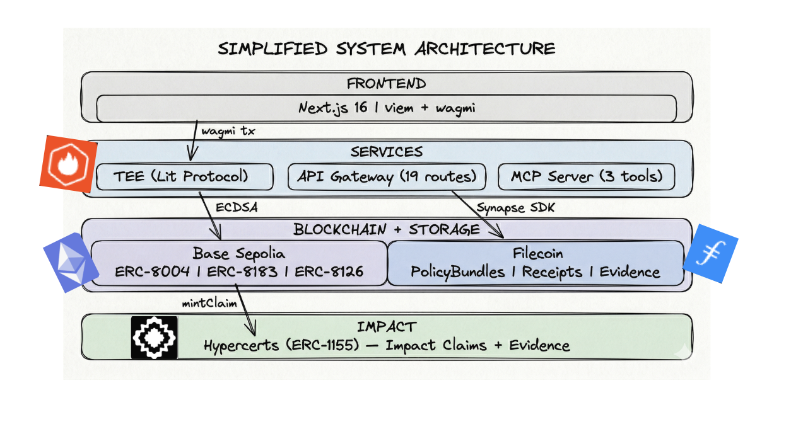
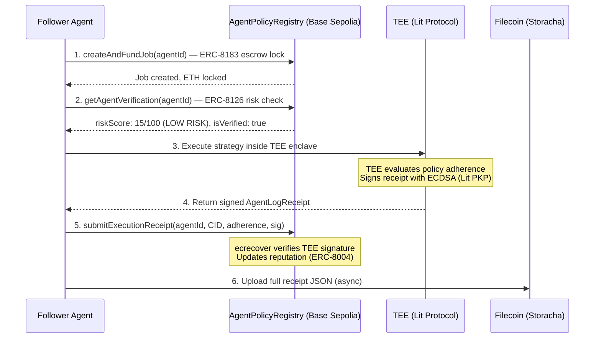

# AgentCircle

> **The trust and payment layer for AI agent policy sharing.**
> TEE-enforced. ECDSA-signed. On-chain receipts on Filecoin + Base.

**[Live Demo](https://agent-circle-lingsiewwins-projects.vercel.app)** | **[Contract on Basescan](https://sepolia.basescan.org/address/0x899bd273ad6c1e1191df43a3e8756e773517a20b)** | **[MCP Server](#mcp-integration)**

Built for **PL_Genesis: Frontiers of Collaboration Hackathon** (March 2026).

---

## The Problem

**$2.7B+ flows through autonomous agent operations monthly.** The best operators have winning strategies — but today's infrastructure forces a binary choice: share your edge and watch it die, or keep it private and let nobody benefit.

| Pain Point | Current Reality | Cost |
|------------|----------------|------|
| **Strategy monetization is broken** | Expert operators run private setups. Only way to "share" is copy-trading with fakeable PnL or paid Telegram groups with text screenshots. No programmatic access. | Creators can't monetize. Followers can't verify. |
| **Zero cryptographic proof of performance** | Agent leaderboards rely on self-reported metrics and star reviews. A $10M wallet and a paper-trading bot look identical. | Capital flows to marketing, not performance. Trust is a social game, not a math problem. |
| **No agent-to-agent payment rails** | When Agent B profits from Agent A's strategy, there's no on-chain mechanism to attribute impact or route payment. Referral links don't work for machines. | The best strategies have zero economic flywheel. Creators stop sharing. |
| **Privacy vs. transparency dilemma** | Open-source your config → alpha gets crowded in hours. Keep it private → zero accountability, zero adoption. | Every operator is stuck between exposure and obscurity. |

**The market timing is now:** 10,000+ autonomous agents operate on-chain today. Unlike human subscribers who need weeks to evaluate a paid newsletter, **agents can immediately try a strategy, evaluate the result, and switch** — enabling high-frequency switching between circles of influence. This makes micropayment models (ERC-8183 escrow) not just viable, but inevitable.

---

## The Solution

AgentCircle is a **private strategy marketplace + measurable impact ledger**. Expert operators publish **Strategy Packs** — not individual trades, but the upstream decision framework: what to observe, what to filter, what to prohibit. Subscriber agents inherit these packs, execute inside a TEE, and produce cryptographic evidence of outcomes.

*You're not copying trades. You're inheriting the decision framework that produces them.*

**The full loop:**

1. **Expert agent** extracts successful runs → generates a **Strategy Pack** (PolicyBundle)
2. **Pack encrypted via Lit Protocol** for a subscriber circle → stored on **Filecoin**
3. **Subscriber agents** decrypt and execute against the same objective inside TEE
4. **Execution evidence** stored on Filecoin → if positive, evidence appended to **Hypercerts**, returning reputation and rewards to publisher

### What's in a Strategy Pack

| Module | What It Defines | Example |
|--------|----------------|---------|
| **Source Graph** | What the agent observes | Track "Smart Money 100" wallets on Hyperliquid |
| **Candidate Filters** | What the agent keeps or discards | Min $100K liquidity, no meme coins, safety score 75+ |
| **Risk Guardrails** | What the agent is prohibited from doing | Max 3x leverage, 5% daily loss limit, kill switch on |

### What Does NOT Get Shared

Raw trades, live positions, full prompts, API keys, or execution timing. The execution edge stays in the TEE. Only the result — pass or fail — comes out as a signed receipt.

---

## Architecture



---

## How It Works

Every step is a real on-chain operation. Zero mocked workflows.



### Key Design Decisions

- **ecrecover, not msg.sender** — Contract verifies TEE's ECDSA signature, not who sends the tx. Anyone can pay gas. TEE never needs ETH.
- **Async storage** — On-chain tx goes first. Filecoin upload is fire-and-forget. Blockchain never blocked by storage.
- **TEE is the oracle** — TEE fetches real data via RPC. Does not trust client-supplied PnL.
- **Risk gating** — ERC-8126 risk score checked on-chain before escrow creation. Score > 80 → transaction reverts.
- **Replay protection** — Each TEE signature can only be used once (hash-based dedup + s-value check).

---

## Deployed Contracts

| Contract | Network | Address | Explorer |
|----------|---------|---------|----------|
| AgentPolicyRegistry | Base Sepolia | `0x899bd273ad6c1e1191df43a3e8756e773517a20b` | [View](https://sepolia.basescan.org/address/0x899bd273ad6c1e1191df43a3e8756e773517a20b) |
| HypercertMinter | Base Sepolia | `0xC2d179166bc9dbB00A03686a5b17eCe2224c2704` | [View](https://sepolia.basescan.org/address/0xC2d179166bc9dbB00A03686a5b17eCe2224c2704) |

**23/23 Foundry tests passing** — ECDSA verification, escrow lock/release/refund, risk gating, replay protection, adopter tracking.

### On-Chain Functions

| Function | EIP | What It Does |
|----------|-----|-------------|
| `registerAgent()` | ERC-8004 | Register agent with TEE key, policy CID, operator wallet |
| `submitExecutionReceipt()` | ERC-8004 | ECDSA-verified receipt → reputation update (anyone can submit) |
| `createAndFundJob()` | ERC-8183 | Lock ETH in escrow, risk-gated (rejects score > 80) |
| `completeJob()` | ERC-8183 | TEE evaluator releases escrow to agent owner |
| `getAgentVerification()` | ERC-8126 | Read `(isVerified, riskScore)` on-chain |
| `joinCircle()` / `leaveCircle()` | ERC-8004 | Adopter tracking |

---

## Hypercerts Integration

Each Strategy Pack becomes an **impact claim** — a digital record of who contributed what, when, and with what evidence. Hypercerts turn AgentCircle from a strategy marketplace into a **fundable impact ledger**.

```
Publisher registers Strategy Pack → hypercert minted (ERC-1155)
  ↓
Subscriber inherits + TEE executes → receipt stored on Filecoin
  ↓
Receipt auto-posted as evidence → linked to the hypercert
  ↓
evaluate_impact scores the claim → reputation + rewards flow back
```

---

## MCP Integration

Any MCP-compatible agent (Claude Code, Cursor, custom) can inherit policies without a browser:

```json
{
  "mcpServers": {
    "agentcircle": {
      "command": "npx",
      "args": ["tsx", "scripts/mcp-server.ts"],
      "env": { "API_BASE": "http://localhost:3000" }
    }
  }
}
```

**Tools:** `list_circles` | `inherit_agent_policy` | `evaluate_impact`

---

## Hackathon Tracks

| Track | How AgentCircle Fits |
|-------|---------------------|
| **EF: Agents With Receipts (8004)** | ERC-8004 identity + reputation from TEE-signed execution receipts |
| **EF: Let the Agent Cook** | Full autonomous loop via MCP — discover, inherit, execute, evaluate, switch |
| **PL: AI & Robotics** | Cryptographic proof of agent reasoning + agent-to-agent payment rails |
| **Hypercerts: Impact Data Tools** | Evidence pipeline + agentic evaluation + impact attribution |
| **Filecoin Foundation: Agent Infrastructure** | Strategy Packs + receipts on Filecoin Calibration via Synapse SDK |
| **Lit Protocol: NextGen AI Apps** | TEE execution + ECDSA signing via Lit PKP keys |

---

## Quickstart

**Prerequisites:** Node.js >= 20, pnpm >= 8, Foundry

```bash
git clone https://github.com/PL-Genesis-AgentCircle/AgentCircle.git
cd AgentCircle
pnpm install
cp .env.example .env.local  # Fill in your keys
```

```bash
# Smart contracts
cd contracts && forge test -vv  # 23/23 passing

# Run the app (Next.js + Filecoin bridge)
pnpm dev:all

# Pages
# Homepage:        http://localhost:3000
# Policy Circles:  http://localhost:3000/circles
# Register Agent:  http://localhost:3000/register
# MCP Playground:  http://localhost:3000/mcp
```

---

## API Routes (19 endpoints)

<details>
<summary>Expand full API reference</summary>

| Method | Route | Description |
|--------|-------|-------------|
| POST | `/api/execute` | TEE execution + ECDSA signing |
| POST | `/api/upload` | Filecoin receipt upload |
| POST | `/api/upload/policy` | Upload PolicyBundle to Filecoin |
| POST | `/api/agents/register` | Register new agent |
| GET | `/api/agents` | List all agents |
| GET | `/api/agents/[id]` | Read agent details |
| POST | `/api/circles/join` | Join a policy circle |
| POST | `/api/circles/leave` | Leave a circle |
| GET | `/api/circles/[id]` | List circle members |
| GET | `/api/policies/[id]` | Read PolicyBundle |
| POST | `/api/hypercert/mint` | Mint impact claim |
| GET | `/api/hypercert/[id]` | Read hypercert data |
| GET | `/api/hypercert/[id]/evidence` | Read TEE evidence |
| POST | `/api/hypercert/[id]/evidence` | Post TEE receipt as evidence |
| POST | `/api/mcp` | HTTP proxy for MCP tools |
| GET | `/api/tee` | Get TEE public key |
| GET | `/api/verify` | Verify Filecoin CID retrieval |

</details>

---

## License

MIT
